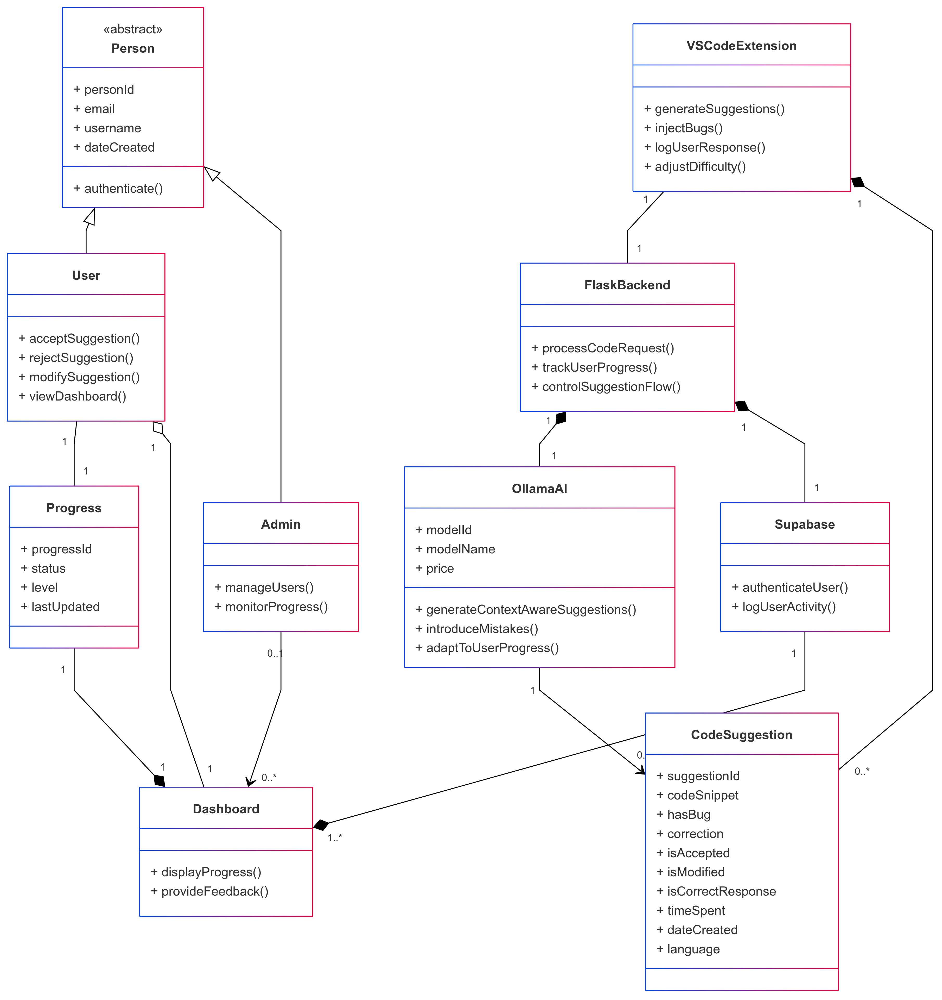

# Class Diagram

## Overview

This class diagram represents the architecture of a **Code Suggestion System** integrated with a VSCode extension, a Flask backend, and AI-driven code suggestions.

**Figure 1.** Class Diagram of the Github Copilot Clone application.

## Classes and Relationships

### 👤 **Abstract Class: Person**

- Defines common attributes (`personId`, `email`, `username`, `dateCreated`) for **User** and **Admin**.
- Includes an `authenticate()` method.

### 🧑‍💻 **User & Admin**

- **User** inherits from **Person** and can:
  - Accept, reject, or modify code suggestions.
  - View the dashboard.
- **Admin** inherits from **Person** and can:
  - Manage users.
  - Monitor progress.

### 🖥️ **VSCodeExtension**

- Generates suggestions and injects bugs to challenge the user.
- Logs user responses and adjusts difficulty.

### 🔧 **FlaskBackend**

- Handles code request processing and user progress tracking.
- Controls the suggestion flow.

### 🤖 **OllamaAI**

- AI-powered component that generates context-aware code suggestions.
- Can introduce mistakes and adapt to user progress.

### ☁️ **Supabase**

- Manages user authentication and logs user activity.

### 📊 **Dashboard**

- Displays user progress and provides feedback.

### 💡 **CodeSuggestion**

- Represents individual code suggestions with attributes like:
  - `codeSnippet`, `hasBug`, `correction`, `isAccepted`, etc.
- Linked to the AI system **(OllamaAI)**.

### 🚀 **Progress**

- Tracks user progress with `status`, `level`, and `lastUpdated`.

## 🔗 **Key Relationships**

1. **VSCodeExtension ↔ FlaskBackend** (1:1)
2. **FlaskBackend ↔ OllamaAI** (1:1)
3. **FlaskBackend ↔ Supabase** (1:1)
4. **OllamaAI ↔ CodeSuggestion** (1:many)
5. **User ↔ Progress** (1:1)
6. **Admin ↔ Dashboard** (0..1:many)
7. **Dashboard ↔ Progress** (1:1)
8. **Supabase ↔ Dashboard** (1:many)
9. **User ↔ Dashboard** (1:1)
10. **VSCodeExtension ↔ CodeSuggestion** (1:many)
