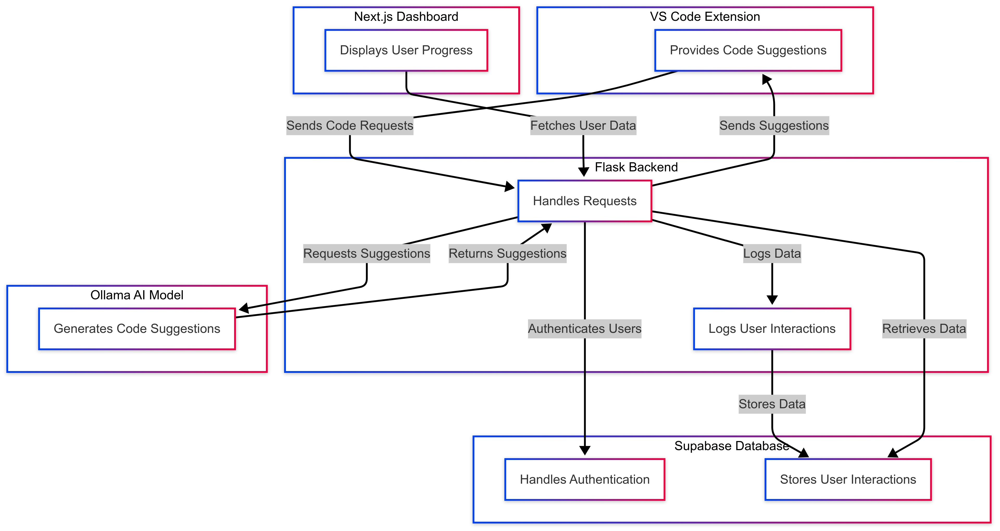

# Component Overview

The AI-assisted coding assistant project consists of several key components and technologies, including a **VS Code extension** for code suggestions, a **Flask backend** for processing and logging user interactions, **Ollama** as the AI model, **Supabase** for authentication and database storage, and a **Next.js dashboard** for users to track their progress.

**Figure 1.** Component Diagram of the Github Copilot Clone application.

## Main Application

### 🛠 **VS Code Extension (TypeScript, Node.js)**

The core of the system is a VS Code extension that provides code suggestions while occasionally introducing small logic errors to test user attentiveness.

#### 🔹 **Key Features:**

- **AI-Powered Code Suggestions** – Uses Ollama to generate helpful code recommendations.
- **Bug Injection** – Sometimes modifies code (e.g., changing `add(a, b)` to `a - b`) to check if users notice mistakes.
- **User Response Logging** – Tracks how users interact with suggestions (accept, modify, or reject).
- **Adjustable Difficulty** – Adapts suggestions based on past responses.

## Backend Services

### 🚀 **Flask (Python)**

The backend handles all API requests between the VS Code extension, AI model, and database.

#### 🔹 **Key Features:**

- **Processes Code Requests** – Sends user code to the AI model and returns suggestions.
- **Tracks User Behavior** – Logs whether users accept, modify, or reject suggestions.
- **Controls Suggestion Flow** – Can slow down suggestions or require manual edits based on user performance.

## AI Model

### 🤖 **Ollama (AI Code Generator)**

The AI model generates code suggestions and sometimes introduces small mistakes to test users.

#### 🔹 **Key Features:**

- **Context-Aware Suggestions** – Provides relevant recommendations based on the user’s code.
- **Intelligent Mistakes** – Occasionally tweaks suggestions with logical errors to test user focus.
- **Adaptive Learning** – Adjusts suggestions based on user behavior.

## Database & Authentication

### 🔐 **Supabase (PostgreSQL, Auth)**

Supabase handles user login and stores all interaction data.

#### 🔹 **Key Features:**

- **User Authentication** – Manages logins and keeps track of individual progress.
- **Logs User Activity** – Records which suggestions were accepted, modified, or rejected.
- **Real-Time Sync** – Updates and injects user progress instantly to the AI model and on the dashboard.

## User Dashboard

### 📊 **Next.js (React, Tailwind CSS)**

The dashboard allows users to view their progress and track their learning journey.

#### 🔹 **Key Features:**

- **Progress Tracking** – Displays stats on correct vs. incorrect responses.
- **Insightful Feedback** – Helps users understand where they need improvement.
- **Encourages Learning** – Provides interactive insights to refine coding skills.
