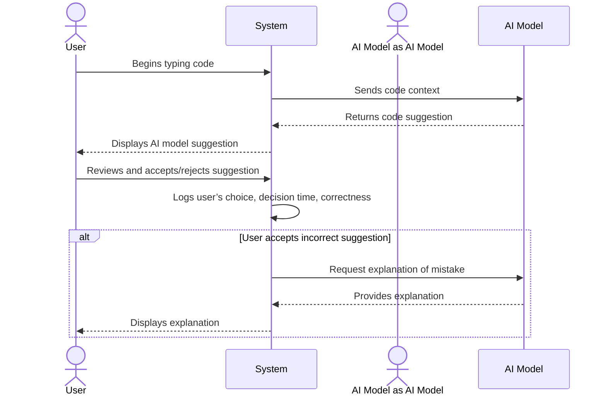
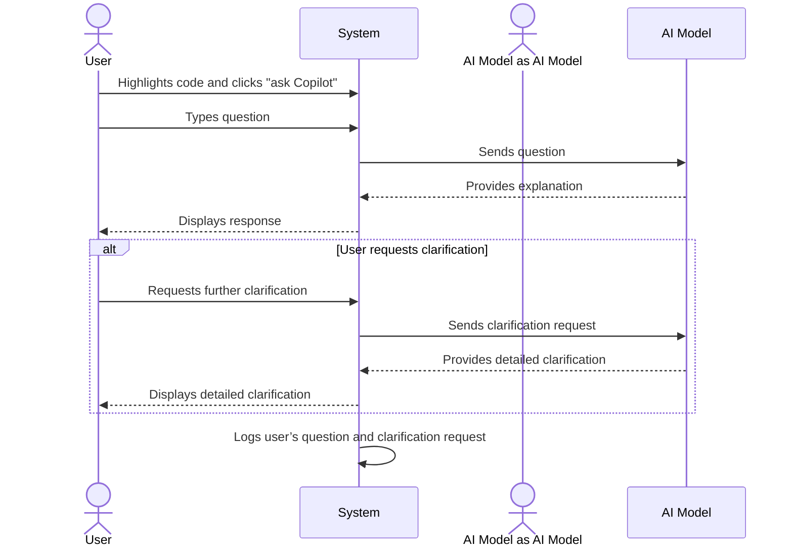
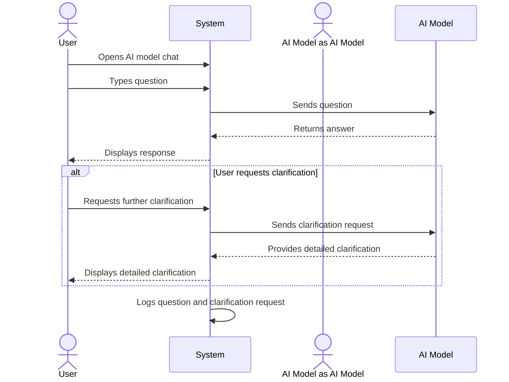
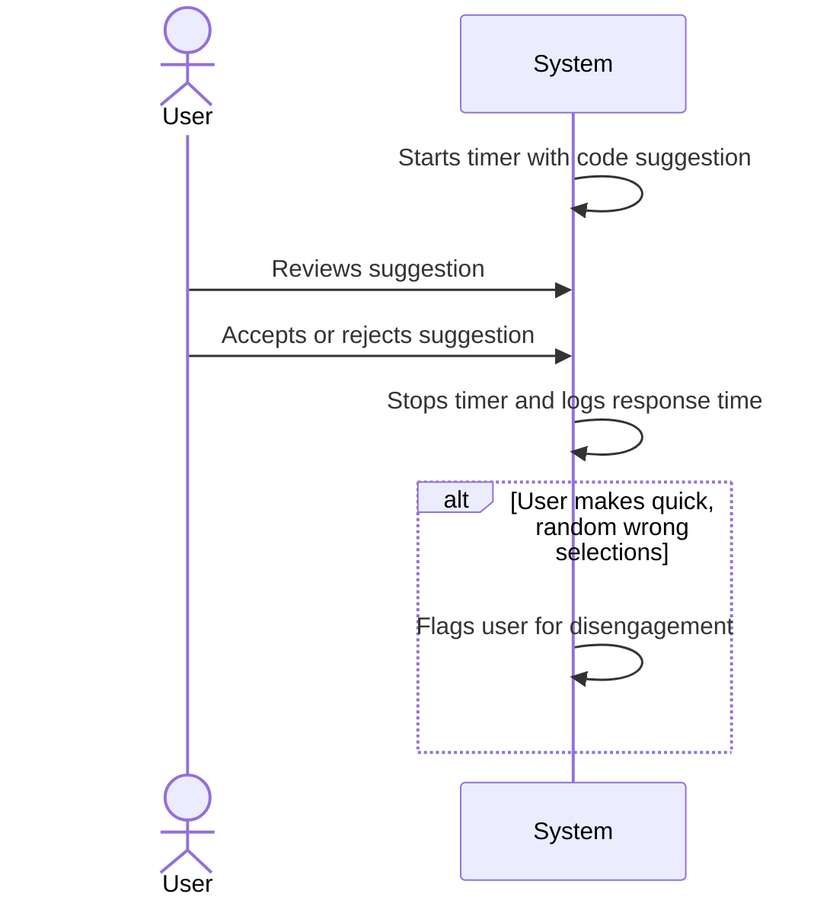
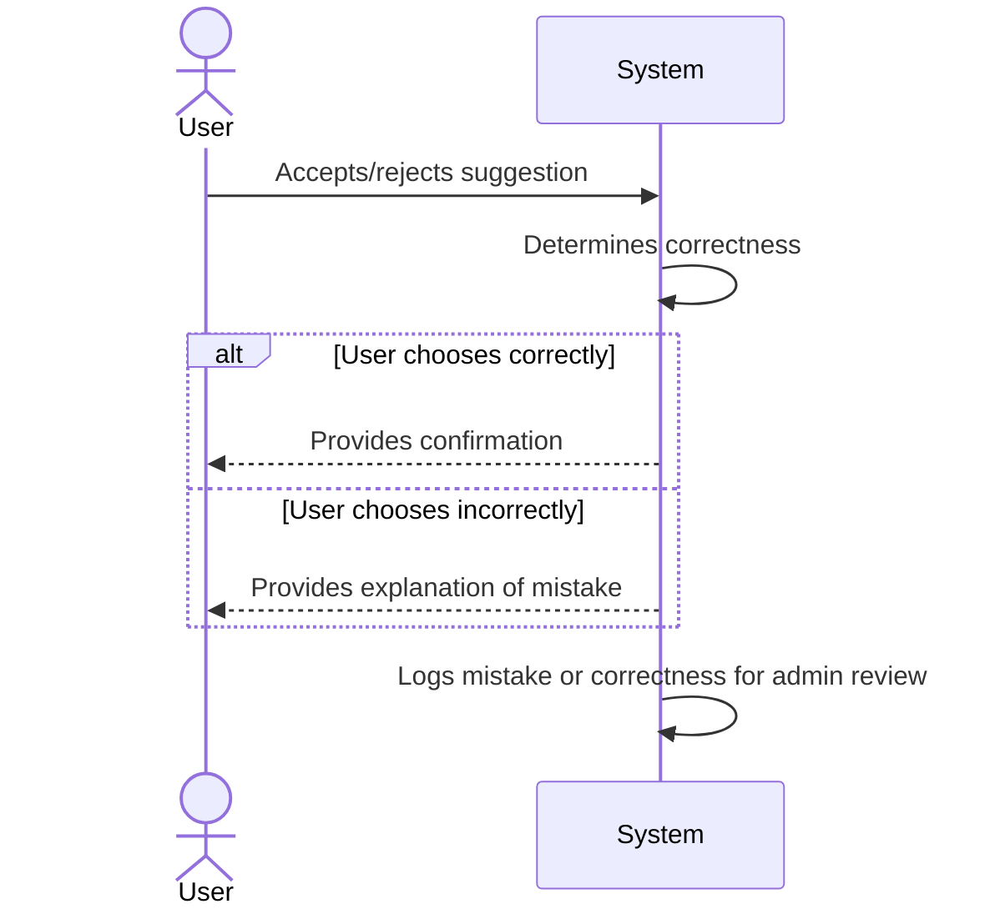
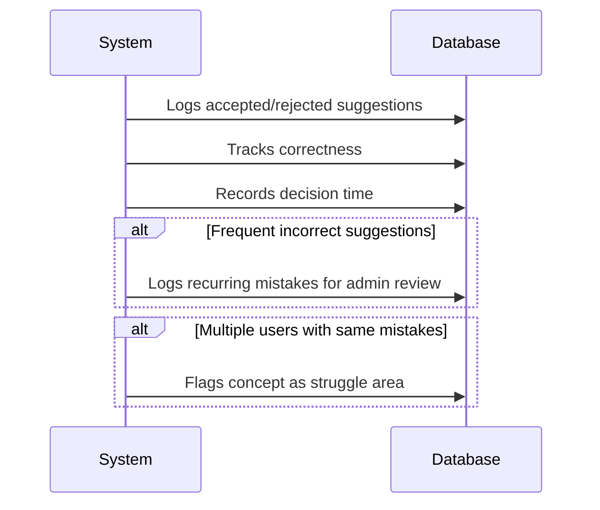
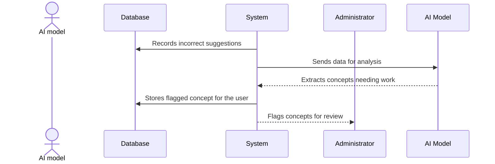
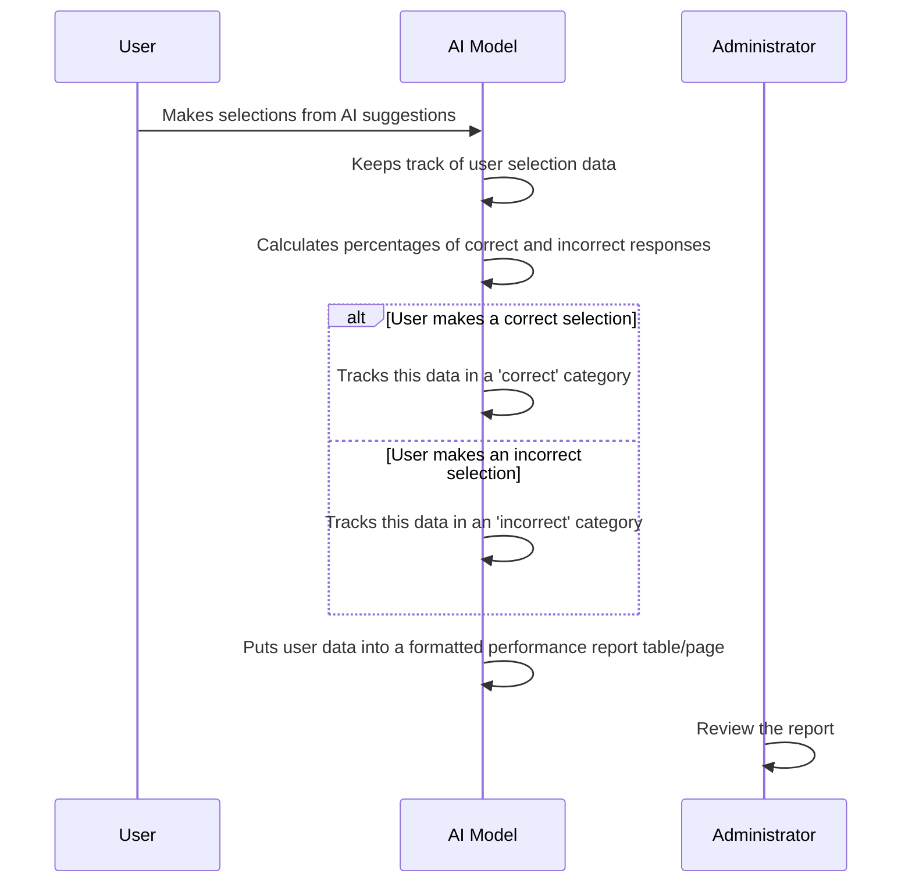
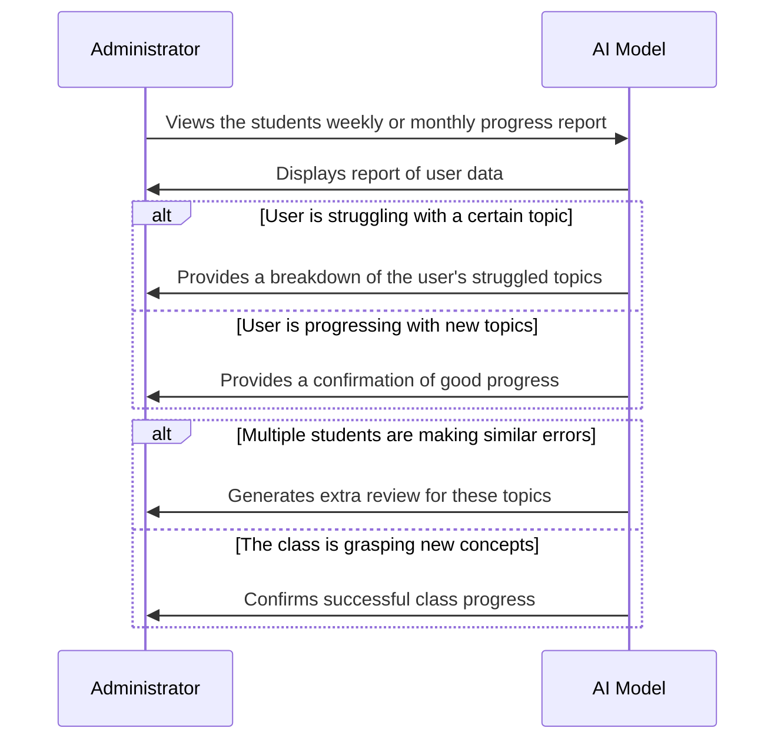
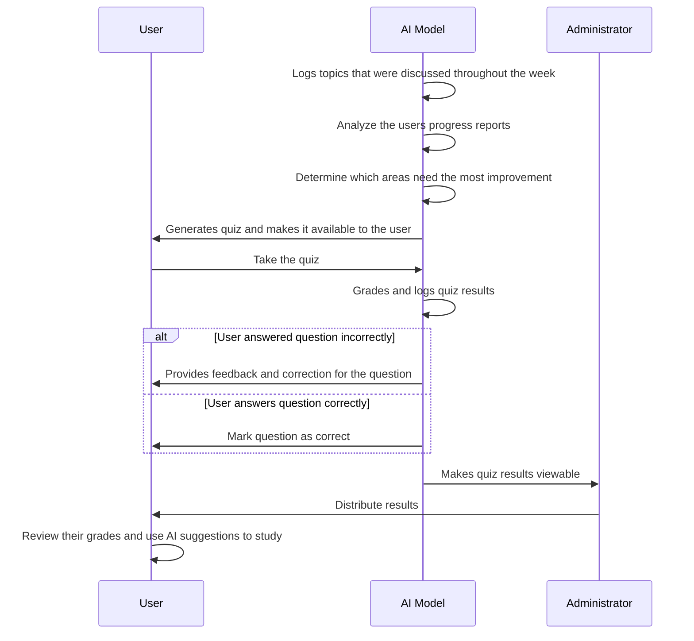

# Sequence Diagrams for Our Use Cases

## Use Case 1: Recieving Context-Aware Code Suggestions

## Use Case 2: Asking Inline Questions about Code

## Use Case 3: Asking Questions in the Copilot Chat 

## Use Case 4: Logging Decision Time for Code Suggestions

## Use Case 5: Recieving Feedback After Selecting a Suggestion

## Use Case 6: Tracking and Logging User Decisions

## Use Case 7: Identifying Common Student Mistakes

## Use Case 8: Generating Learning Reports for Administrators

## Use Case 9: Monitoring User's Progress

## Use Case 10: AI Generated Quiz Based off of Previous Topics

